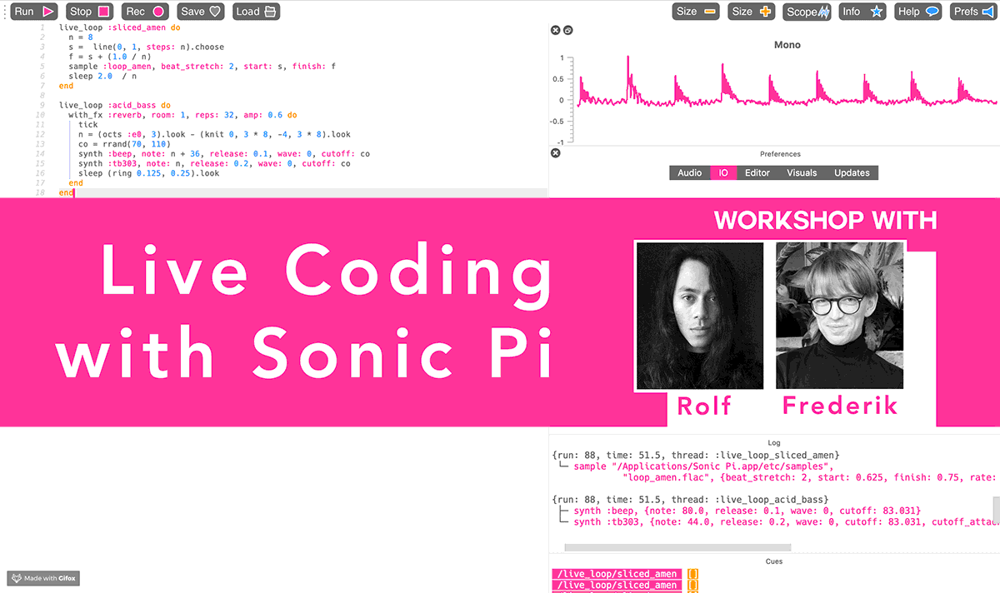

# PCD2020: Sonic Pi Workshop
This is a repo containing all of the information from the Sonic Pi beginner workshop, PCD2020 event. This is a collaboration between Rolf Holm and Frederik la Cour. participants are required to bring their own laptops, a pair of headphones and a curious open mind!



## Agenda

- What is Live Coding? (ETA 5 min)
- Tutorial (ETA 15 min)
- Participants Practice (ETA 25 min )
- Live Coding performance (ETA 8 min)
- Q&A 

## What is Live Coding? (ETA 5 min)

livecoding as a practice, and philosophy of livecoding.

* Code with music
* Cyclic
* Algorave-culture


* Finally, nothing is right, nothing is wrong, only learning and having fun matters.

## Sonic Pi Installation

Download sonic pi from: https://sonic-pi.net/ , and open it.

if you have wifi problems a USB with sonic pi will be available 


## Tutorial (ETA 15 min)

**Components:** play, sleep, sample, effect, live_loop
**Commands:** run, stop.
**Synth options:** amp, rate.

1. Write in Sonic Pi:

  ```ruby
  Play 60
  ```
  Then press alt+r to run. Congrats, you can now make sounds.

2. Sleep. Write:

  ```ruby
  Play 60
  Sleep 1
  Play 65
  ```

  Notice the code “slept” or for one second before triggering the next piece of code.

3. Samples! Write:

  ```ruby
  Sample :ambi_choir
  ```
  Then alt+r again. That’s a sample. Try some other ones.

4. Options! Make the sounds go slower or faster and adjust the volume with amp and rate. Write:

  ```ruby
  Sample :ambi_choir, rate: 0.5, amp: 0.5
  ```

   The sample now runs at half speed with half volume. Try putting in some other numbers, to see what happens. 

5. Effects! Write:

  ```ruby
  With_fx :whammy do
  Sample :ambi_choir
  End
  ```

  And run it. Now it has a whammy effect! Try reverb, or distortion.

6. Live_loop! This is a type of block that repeats itself upon finishing. What’s neat is that you can change the code within the block without having to stop. Remember to make it sleep. Write:

  ```ruby
  Live_loop :foo do
  Sample :ambi_choir
  Sleep 1
  End
  ```

  And run it.

## Participants Practice (ETA 30 min)


## Live Coding performance (ETA 8 min)


## Q & A

